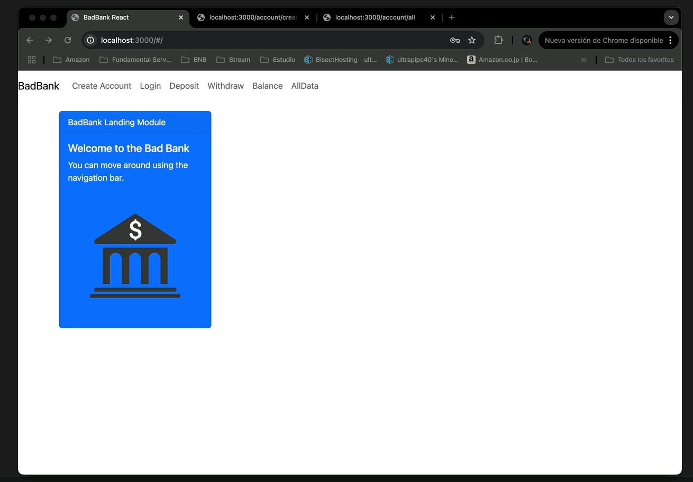
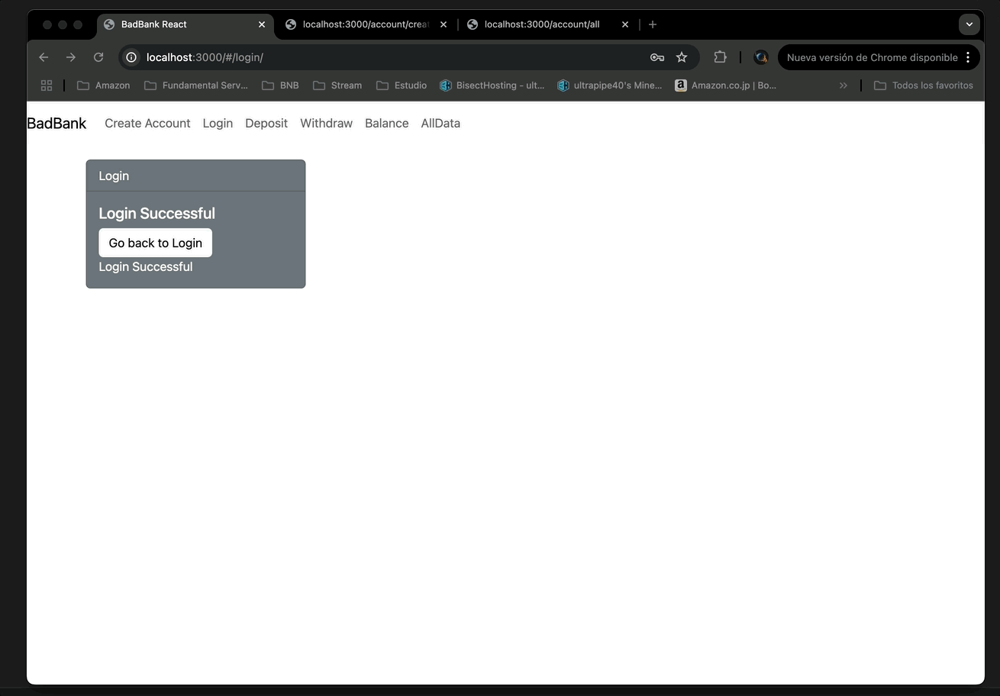
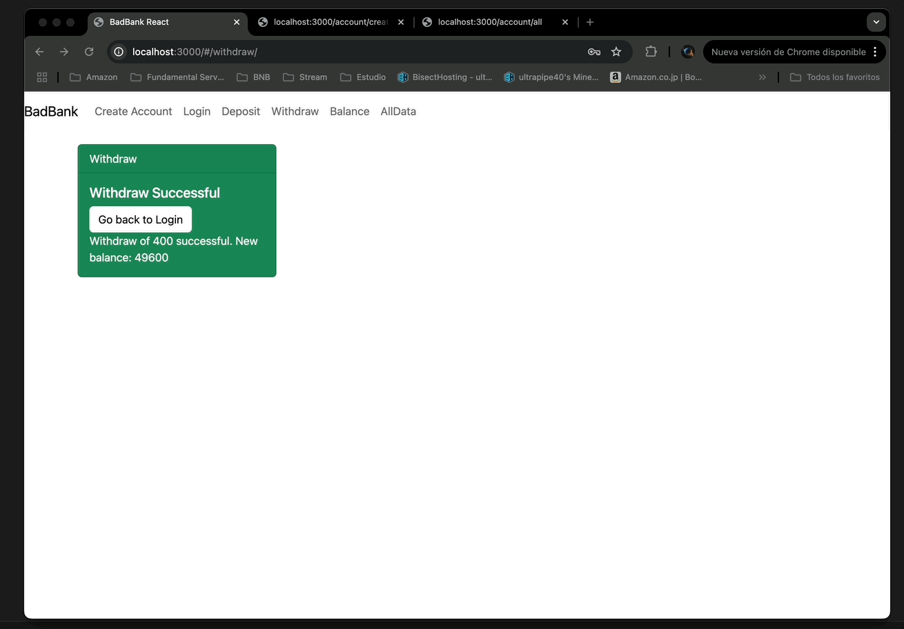

# Proyecto Bad Bank

## Descripción/Motivación

El Proyecto Bad Bank simula una aplicacion de banco donde uno puede crear usuarios, realizar depositos, retiros, consultar saldo y ver todos los usuarios. 

### Motivación:

La construi para poder aprender y mejorar mis habilidades en la construccion de aplicaciones full-stack, con el
uso de React, MongoDB, Express y Node.js.

El proposito de esta aplicacion es enfocada en el aprendizaje, ya que brinda una buena cantidad de desafios sobre la marcha 
y permite a uno tener mejor nocion de como enlazar las distintas tecnologias para poder llevar acabo el proyecto de uno.


### ¿A quién ayuda?

El ejerccio de Bad Bank ayuda  a los nuevos desarrolladores a aprender y practicar en el desarrollo de apliciones full-stack
y tambien sirve para aquellos que quieran aprender sobre autentificacion de usuarios.

## Instrucciones de Instalación

Para comenzar con este proyecto:

1. Clona el repositorio:

    ```bash
    git clone https://github.com/usuario/bad-bank.git
    ```

2. Navega al directorio del proyecto:

    ```bash
    cd bad-bank
    ```

3. Instala las dependencias necesarias:

    ```bash
    npm install
    ```

4. Ejecuta el servidor:

    ```bash
    node index.js
    ```

La aplicación estará disponible en [http://localhost:3000](http://localhost:3000).

## Capturas de Pantalla

### Creacion de Cuenta y Login


### Deposito y Retiro


### Saldo y Datos


### Captura de Pantalla: Studio 3T for MongoDB


## Tecnologías Utilizadas

- **Front-end**: React
- **Back-end**: Express, Node.js
- **Base de datos**: MongoDB


## Funcionalidades

- Creación de cuentas de usuario.
- Login de usuarios.
- Realización de depósitos y retiros.
- Consulta de saldo.

## Trabajo a Futuro
Agregar un sistema de autentificacion para que al hacer login sea la unica manera de acceder a los depositos, retiros y consulta de saldo.

## Licencia

Este proyecto está bajo la licencia MIT.
